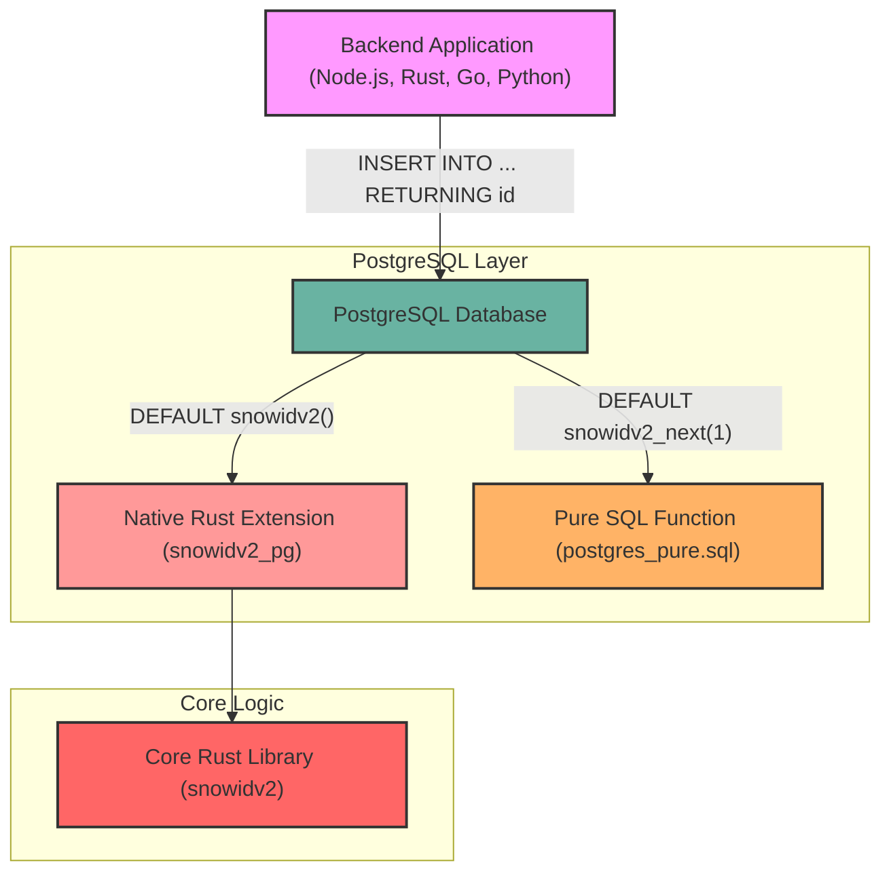

# SnowIDv2 ❄️

[](https://opensource.org/licenses/MIT)
[](https://github.com/ArmanX-Labs/SnowIDv2/actions/workflows/rust.yml)
[](https://www.postgresql.org/)
[](https://github.com/ArmanX-Labs/SnowIDv2/pulls)
[](https://github.com/ArmanX-Labs/SnowIDv2)

High-performance, 64-bit Snowflake-style distributed ID generator for PostgreSQL and Rust.

Generate strictly time-ordered, distributed, 64-bit IDs directly inside your database—**zero application-side ID generation needed**.

---

## Why SnowIDv2?

- **Half the storage of UUIDs**: Only **8 bytes (`BIGINT` / `i64`)** vs 16 bytes for UUIDv4/UUIDv7. Uses 50% less RAM, disk, and cache for indexes and foreign keys.
- **Zero B-Tree Index Fragmentation**: Strictly time-ordered IDs ensure append-only B-tree index inserts in PostgreSQL.
- **Language & Framework Independent**: Works seamlessly with any backend language (Node.js, Python, Go, Java, Rust, C#, PHP) or ORM (Prisma, Drizzle, SQLAlchemy, GORM).
- **Blazing Fast**: Generates over **40,000,000 IDs per second** concurrently (~25 nanoseconds per ID).

---

## 🏗️ Architecture



---

## 🧩 How it Works (Bit Layout)

SnowIDv2 generates a 64-bit integer (`BIGINT`) composed of three parts, keeping the highest bit `0` so it remains positive:

| Timestamp (41 bits) | Machine ID (10 bits) | Sequence (12 bits) |
| :--- | :--- | :--- |
| Milliseconds since custom epoch | Configurable node/worker ID | Auto-incrementing per millisecond |

- **41 bits for timestamp**: Gives us ~69 years of IDs before rolling over.
- **10 bits for machine ID**: Supports up to 1024 unique database nodes or application workers.
- **12 bits for sequence**: Supports generating up to 4,096 unique IDs per millisecond, per machine.

---

## 🚀 Quick Start (Rust Application)

If you just want to generate Snowflake IDs directly inside your Rust application (without relying on the database to generate them), it's as simple as calling a single function!

1. Add the core library to your `Cargo.toml`:
```bash
cargo add snowidv2
```

2. Generate an ID anywhere in your code:
```rust
use snowidv2;

fn main() {
    // Generate an ID using the default machine ID (1)
    let id = snowidv2::generate_id();
    println!("Generated ID: {}", id);

    // Or specify exactly which machine/worker is generating the ID
    let worker_id = snowidv2::generate_id_for_machine(2);
    println!("Generated ID from worker 2: {}", worker_id);
}
```

---

## 🚀 Quick Start (PostgreSQL)

### Option 1: Managed Cloud PostgreSQL (AWS RDS, Supabase, Neon, Railway)
You can inject the ID generator directly into any Postgres database using pure SQL, without installing any native extensions. 

**Zero-Setup from Rust (SQLx, Diesel, etc.):**
The core `snowidv2` crate embeds the pure SQL script natively. You can execute it on startup against your database pool without downloading anything manually:
```rust
// Execute this once on application startup to create the `snowidv2_next()` function
sqlx::query(snowidv2::POSTGRES_PURE_SQL)
    .execute(&pool)
    .await?;
```

**Manual Setup:**
Alternatively, run the turnkey pure SQL script [`sql/postgres_pure.sql`](sql/postgres_pure.sql) in your database query editor:

```sql
-- 1. Run sql/postgres_pure.sql (or use the Rust snippet above) once to define snowidv2_next(machine_id)

-- 2. Define your table with DEFAULT snowidv2_next(1)
CREATE TABLE users (
    id BIGINT PRIMARY KEY DEFAULT snowidv2_next(1),
    username TEXT NOT NULL,
    created_at TIMESTAMPTZ DEFAULT NOW()
);

-- 3. Application inserts directly without generating IDs first:
INSERT INTO users (username) VALUES ('alice') RETURNING id;
```

### Option 2: Self-Hosted PostgreSQL / Docker (Native C/Rust Extension)

#### Using Docker & Docker Compose (Recommended for Local Dev / Containerized Deployments)
We provide a multi-stage `Dockerfile` and `docker-compose.yml` that builds and pre-installs the native Rust extension automatically:

```bash
# Start PostgreSQL 17 with the SnowIDv2 native extension pre-installed
docker compose up -d --build

# Connect to the database and test ID generation right away
docker exec -it snowidv2_postgres psql -U postgres -d snowidv2_demo
```

Or build directly with Docker:
```bash
docker build --build-arg PG_MAJOR=17 -t snowidv2-postgres:latest .
docker run -d --name snowidv2-pg -p 5432:5432 -e POSTGRES_PASSWORD=postgres snowidv2-postgres:latest
```

Once running inside PostgreSQL, enable and use the extension:

```sql
CREATE EXTENSION IF NOT EXISTS snowidv2;

CREATE TABLE orders (
    id BIGINT PRIMARY KEY DEFAULT snowidv2(), -- Or DEFAULT snowidv2_with_machine(2)
    amount NUMERIC(10, 2) NOT NULL
);

INSERT INTO orders (amount) VALUES (99.99) RETURNING id;
```

---

## 🔍 Decoding IDs in SQL

Inspect when any ID was created and which machine node generated it:

```sql
SELECT * FROM snowidv2_decode(119842790364971008);
```

---

## ⚡ Performance Benchmark

Run the included benchmark on your machine:

```bash
cargo run --release -p snowidv2 --example benchmark
```

```
1. Single-Threaded Generator (`SnowIdGenerator::generate`):
   - Throughput:          16,446,117 IDs/sec
   - Latency per ID:         60.80 ns/ID

2. Multi-Threaded Concurrent Generation (8 Threads across machines):
   - Throughput:          39,718,988 IDs/sec
   - Latency per ID:         25.18 ns/ID
```

---

## 📦 Project Structure

```
SnowIDv2/
├── Dockerfile               # Multi-stage build for PostgreSQL with SnowIDv2 pre-installed
├── docker-compose.yml       # Turnkey Docker Compose configuration
├── docker/
│   └── initdb/              # Auto-initialization scripts when running via Docker
├── snowidv2/                  # Core pure-Rust Snowflake generator library
├── snowidv2_pg/               # PostgreSQL Extension wrapper (CREATE EXTENSION snowidv2;)
├── sql/
│   ├── postgres_pure.sql    # Pure PL/pgSQL function for Cloud/Managed Postgres
│   └── schema_examples.sql  # Turnkey schema & zero-app-generation examples
└── README.md
```

---

## 🤝 Contributing

We love contributions! Whether you're fixing a bug, adding a new language example, or improving the documentation, your help is welcome.

We have created several **[Good First Issues](https://github.com/ArmanX-Labs/SnowIDv2/issues?q=is%3Aissue+is%3Aopen+label%3A%22good+first+issue%22)** specifically designed for new open-source contributors. Feel free to pick one up!

Please read our [Contributing Guide](CONTRIBUTING.md) to learn how to set up your environment, run tests, and submit a Pull Request. Don't forget to review our [Code of Conduct](CODE_OF_CONDUCT.md) as well.
